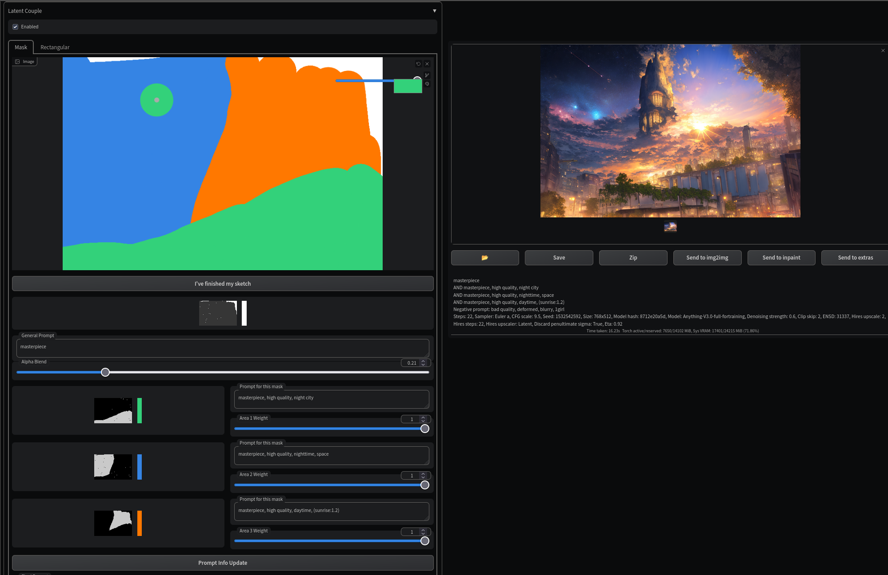

# Latent Couple extension (two shot diffusion port)
This extension is an extension of the built-in Composable Diffusion.
This allows you to determine the region of the latent space that reflects your subprompts.

## How to use



### Enabled
The effect of Latent Couple appears only when Enabled is checked.

### Divisions, Positions, and Weights
Regions are created based on these parameters.

### end at this step
The processing of Latent Couple is performed until the specified step is reached.

### Visualize button and Regions
Press the Visualize button and you will get an image grid that visualizes the regions represented by the parameters.

### Extra generation params and Apply button
When you press the Send to button in PNG Info, the parameters of the saved Latent Couple are set to Extra generation params.
Press the Apply button to actually apply the parameters.

## Extra generation params
Extra generation params provided by this extension are saved as PNG Info in the output file.
```
Latent Couple: "divisions=1:1,1:2,1:2 positions=0:0,0:0,0:1 weights=0.2,0.8,0.8 end at step=20"
```

## Examples
parameters
```
((ultra-detailed)), ((illustration)), 2girls
AND ((ultra-detailed)), ((illustration)), 2girls, black hair
AND ((ultra-detailed)), ((illustration)), 2girls, blonde hair
Negative prompt: (low quality, worst quality:1.4)
Steps: 28, Sampler: Euler a, CFG scale: 5, Seed: 722014241, Size: 512x512, Model hash: 3f64f3baf5, Model: Anything-v3.0-fp16, ENSD: 31337, Latent Couple: "divisions=1:1,1:2,1:2 positions=0:0,0:0,0:1 weights=0.2,0.8,0.8 end at step=20", Eta: 0.67
```
outputs
- end at step=20 https://imgur.com/OEaRFgh
- end at step=4 https://imgur.com/a1kyvhX
- end at step=0 https://imgur.com/yhGF7g8


## ~~Prerequisite for prompt pasting~~
## ~~Prerequisite for gradio Image and Sketch component bug fix~~
This fix is no longer suitable for latest webui commit at 22bcc7be, with gradio dependency upgraded to 3.23. 

I'll keep the fix here for people still using older versions of webui.

Activate your venv in webui root directory

For Windows, in cmd
```
venv\Scripts\activate.bat
```
For Linux
```
source venv/bin/activate
```
Then, install wheel distribution with bugfix applied
```
pip install --force-reinstall --no-deps extensions/stable-diffusion-webui-two-shot/gradio-3.16.2-py3-none-any.whl
```
For bugfix related modifications, see https://github.com/ashen-sensored/gradio/tree/3.16.2


## Issues
- ~~The extension's mask color sketching function does not work well with chrome(extreme stuttering) due to gradio's Image component bug.~~ Please keep the browser scaling at 100% while creating blank canvas to avoid the bug. 
See prerequisite above. The fix is no longer suitable for latest webui version at 22bcc7be, with gradio dependency upgraded to 3.23. 


## Credits
- two shot diffusion.ipynb https://colab.research.google.com/drive/1UdElpQfKFjY5luch9v_LlmSdH7AmeiDe?usp=sharing
